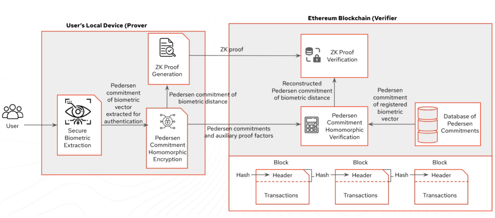
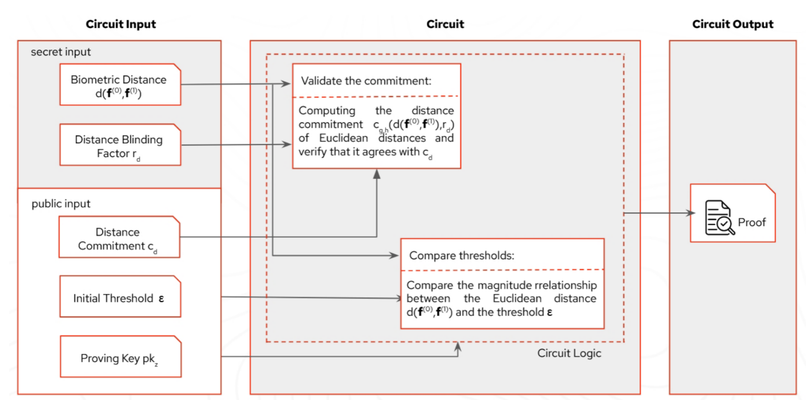

# OwnFace · 自有脸

**Own Your Face Before Own Your Data · 先拥有你的脸，再拥有你的数据**

OwnFace 是一套端到端的零知识生物认证栈：前端采集脸部嵌入向量，后端通过 Pedersen 承诺与 Groth16 证明封装隐私，智能合约在链上验证证明并记录认证快照。  
This repository consolidates the architecture, implementation, and roadmap described across `PROJECT_PLAN.md`, `README1.md`, and the subsystem docs, providing a bilingual reference for developers and reviewers.

---

## 目录 · Table of Contents

1. [项目概述 Overview](#项目概述--overview)  
2. [系统结构 Architecture](#系统结构--architecture)  
3. [隐私与密码学 Privacy & Cryptography](#隐私与密码学--privacy--cryptography)  
4. [组件划分 Components](#组件划分--components)  
5. [端到端流程 Workflow](#端到端流程--workflow)  
6. [快速开始 Getting Started](#快速开始--getting-started)  
7. [环境变量 Environment Variables](#环境变量--environment-variables)  
8. [合约部署 Contracts](#合约部署--contracts)  
9. [路线图 Roadmap](#路线图--roadmap)  
10. [团队与联系 Team & Contact](#团队与联系--team--contact)

---

## 项目概述 · Overview

- **项目名称 / Name**：OwnFace  
- **一句话介绍 / Tagline**：基于零知识证明的去中心化生物识别登录，证明“我就是我”而无需暴露脸部数据。  
- **动机 / Motivation**：传统云端人脸识别泄露风险大；Web3 缺乏面向 KYC / 风控的隐私友好型身份验证方案。  
- **目标用户 / Target Users**：加密钱包、需人脸校验的 dApp、DAO 访问控制、希望托管自有生物特征的个人用户。  
- **解决方案 / Solution**：  
  1. 前端（Next.js）采集嵌入并发起链上调用；  
  2. 后端（Node.js + TypeScript）量化向量、生成 Pedersen 承诺与 Groth16 证明；  
  3. 合约（Solidity/Hardhat）验证证明并存储注册/认证快照；  
  4. 整个流程中原始嵌入仅在用户设备与后端内存中存在。

---

## 系统结构 · Architecture



**说明 / Highlights**
- **前端 Frontend**：集成 RainbowKit / wagmi，提供摄像头或文件上传、交易提示、零知识结果展示。  
- **后端 Backend**：处理嵌入量化、Pedersen 承诺、Poseidon 哈希、Groth16 证明生成与验签。  
- **合约 Contracts**：`OwnFaceRegistry` 记录注册承诺与认证结果；`Groth16Verifier` 验证距离电路证明。  
- **度量 Metrics**：`/metrics` 路由输出注册数量、认证次数与平均证明耗时，便于运营与监控。

---

## 隐私与密码学 · Privacy & Cryptography

### Pedersen 承诺 · Pedersen Commitments

- **公式 / Formula**：`C = r·G + Σ vᵢ·Hᵢ`  
  - `vᵢ`：量化后的 embedding 分量，映射到 babyjubjub/BLS12-381 有限域；  
  - `Hᵢ`：circomlib 提供的独立生成元；  
  - `r`：32 字节随机盲因子，确保 hiding；  
  - `G`：babyjubjub 曲线基点。  
- **链上字段 / On-chain fields**：  
  - `commitmentPoint`（压缩曲线点）、`commitmentHash`（Poseidon/Keccak 摘要），  
  - `blinding`、`nonceHash`、`vectorHash` 提供后续认证比对。  
- **隐私属性 / Guarantees**：  
  - 随机盲因子防止第三方从承诺推断真实向量；  
  - 在 `backend/src/crypto/pedersen.ts` 实现中，承诺哈希用于快速索引，承诺点参与链上验证。  
- **绑定性 / Binding**：若用户试图替换 embedding，将在认证阶段因 `referenceHash` 与链上记录不匹配而失败。

### Poseidon 哈希 · Poseidon Hashing

- `poseidonHashVector` 将量化向量压缩为 field 元素，用作：  
  1. Groth16 电路公开信号 `referenceHash`；  
  2. 链上 `vectorHash` 字段，实现注册与认证的哈希比对。  
- `poseidonHashTranscript` 结合 `(referenceHash, candidateHash, threshold, distance)` 生成 `transcriptHash`，确保证明与传参一致。

### Groth16 证明 · Groth16 Proofs



- **电路功能 / Circuit goal**：验证候选向量与注册向量的平方距离是否低于阈值。  
- **公开信号 / Public signals**：`distance`、`threshold`、`within`、`referenceHash`、`candidateHash`、`transcriptHash`。  
- **证明生成 / Proving**：后端使用 snarkjs (`groth16.fullProve`) 对 Circom `distance.circom` 生成证明，证明文件与 `verification_key.json` 存于 `backend/circuits`。  
- **链上验证 / On-chain verification**：`OwnFaceRegistry.authenticate` 调用 `Groth16Verifier.verifyProof`，校验成功后更新 `VerificationRecord`（accepted、distance、threshold、hashes、timestamp）。

---

## 组件划分 · Components

| 模块 Module | 技术栈 Stack | 职责 Responsibility |
| --- | --- | --- |
| `frontend` | Next.js 15, React 19, RainbowKit, wagmi, viem, Tailwind | 注册/认证 UI、摄像头采集、钱包交互、交易状态与证明展示 |
| `backend` | Node.js 20+, Express, TypeScript, snarkjs, circomlibjs, zod | 嵌入量化、Poseidon 哈希、Pedersen 承诺、Groth16 生成与验签、REST API |
| `contract` | Solidity 0.8.24, Hardhat, TypeScript scripts | `OwnFaceRegistry`（承诺存储与认证记录）、`Groth16Verifier`（距离电路验证） |
| circuits | Circom 2, snarkjs | `distance.circom`、`.wasm`、`.zkey`、`verification_key.json` |

本仓库采用 Git 子模块管理三大子项目（见上述目录），每个子模块保留独立版本历史，支持解耦迭代。

---

## 端到端流程 · Workflow

1. **注册 Registration**  
   - 前端采集 embedding 并调用后端 `/register`；  
   - 后端输出 `commitmentHash`、`commitmentPoint`、`blinding`、`nonce`、`nonceHash`、`vectorHash`；  
   - 前端通过 wagmi 发起 `register` 交易，合约写入 `Commitment` 结构体。  
2. **认证 Authentication**  
   - 前端采集新 embedding → 后端 `/authenticate` 生成 Groth16 证明及公开信号；  
   - 前端提交 `authenticate` 交易，合约校验证明与哈希比对，留下 `VerificationRecord`。  
3. **获取快照 Snapshots**  
   - 任意客户端可调用 `getCommitment` 与 `getVerification` 获取实时链上状态，或直接监听事件。  
4. **指标监控 Metrics**  
   - `/metrics` 返回注册数、认证数、平均证明耗时与最近一次证明数据，用于运营看板或自定义监控。

整个流程无“伪造写入”，即使前端为了更好的 UX 在 3 秒后弹出成功提示，底层仍会等待真实交易回执并刷新链上快照。

---

## 快速开始 · Getting Started

1. **克隆仓库 Clone repository**
   ```bash
   git clone --recurse-submodules https://github.com/Coooder-Crypto/OwnFace.git
   cd OwnFace
   ```
2. **安装依赖 Install dependencies**
   ```bash
   cd backend && npm install
   cd ../frontend && npm install
   cd ../contract && npm install
   ```
3. **生成电路（可选） Build circuits (optional)**
   ```bash
   cd backend
   npm run circuits:build   # 重新编译 distance 电路与 zkey
   ```
4. **启动服务 Launch services**
   ```bash
   # backend
   cd backend
   npm run dev   # http://localhost:4000

   # frontend
   cd ../frontend
   npm run dev   # http://localhost:3000
   ```
5. **部署合约 Deploy contracts**
   ```bash
   cd contract
   npx hardhat compile
   npx hardhat run scripts/deploy-verifier.ts --network sepolia
   ```
6. **体验流程 Experience the flow**  
   - 配置 `frontend/.env.local`（见下节），连接 Sepolia 测试钱包。  
   - 注册时上传任意 16 维向量（JSON/CSV）或使用摄像头生成 embedding。  
   - 认证时可复用注册向量或提供新向量，查看链上确认与 UI 快照。

---

## 环境变量 · Environment Variables

**Frontend (`frontend/.env.local`)**
```
NEXT_PUBLIC_SEPOLIA_RPC_URL=https://sepolia.infura.io/v3/<YOUR_KEY>
NEXT_PUBLIC_WALLETCONNECT_PROJECT_ID=<walletconnect_id>
NEXT_PUBLIC_REGISTRY_ADDRESS=0x9F361ac7525F8c6f4306585F048Ebd7Bc75D4354
NEXT_PUBLIC_VERIFIER_ADDRESS=0xB28A3296ad9Add5BDB0C82b386229a34bAa17b1d
NEXT_PUBLIC_API_BASE_URL=http://localhost:4000
NEXT_PUBLIC_BLOCK_EXPLORER_BASE=https://sepolia.etherscan.io
```

**Backend (`backend/.env`, optional)**
```
PORT=4000
PROVER_THREADS=4
```

**Contract (`contract/.env`)**
```
SEPOLIA_RPC_URL="https://sepolia.infura.io/v3/<YOUR_KEY>"
DEPLOYER_PRIVATE_KEY="0x..."
ETHERSCAN_API_KEY=""
```

---

## 合约部署 · Contracts

- **网络 / Network**：Sepolia 测试网  
- **核心地址 / Addresses**
  ```
  OwnFaceRegistry: 0x9F361ac7525F8c6f4306585F048Ebd7Bc75D4354
  Groth16Verifier: 0xB28A3296ad9Add5BDB0C82b386229a34bAa17b1d
  ```
- **常用命令 / Common commands**
  ```bash
  npx hardhat compile
  npx hardhat run scripts/deploy-verifier.ts --network sepolia
  ```
- **最小复现脚本 / Minimal reproduction**
  ```bash
  # 1. 编译合约
  npx hardhat compile

  # 2. 部署 verifier + registry（示例脚本，可根据需求定制）
  npx hardhat run scripts/deploy-all.ts --network sepolia
  ```
- 合约 Etherscan 验证与自动化部署脚本将于赛后补充（参考 `README1.md` 提交物计划）。

---

## 路线图 · Roadmap

来自 `PROJECT_PLAN.md` 与 `README1.md` 的关键节点：

- **赛后 1-3 周 / Weeks 1-3**  
  - 完成合约 Etherscan 验证与自动化部署脚本。  
  - 后端存储迁移至 SQLite/PostgreSQL，并提供备份 / 审计工具。  
  - 发布中文版 Demo 视频与技术白皮书草稿。

- **赛后 1-3 个月 / Months 1-3**  
  - 上线移动端轻客户端 SDK，支持离线 embedding 与本地签名。  
  - 将 prover 服务模块化，支持 GPU 加速与云端编排。  
  - 与合作方对接 2-3 个真实业务场景（KYC、DAO 访问控制、带生物因子的 MPC 钱包）。

- **长期价值 / Long-term impact**  
  - 构建开源、可审计、可扩展的零知识生物认证基建，推动 Web3 身份体系标准化。  
  - 促进生物识别 + ZKP 的跨项目互操作，降低合规成本与接入门槛。

---

## 团队与联系 · Team & Contact

- **团队 Team**：OwnFace Core  
- **成员 Members**：  
  - Coooder — 全栈工程师 / Full-stack (架构、前端、合约集成)  
  - 0xBiometric — 密码学工程师 / Cryptography (Circom 电路、Groth16 证明)  
  - Sora — 产品设计师 / Product (体验设计、运营内容)  
- **联系方式 Contact**：  
  - GitHub Issues: <https://github.com/Coooder-Crypto/OwnFace/issues>  
  - Telegram: `@ownface_xyz`（如频道暂未开放，可通过 Issues 预约演示）  
- **可演示时段 Demo availability**：UTC+8 每日 10:00 - 22:00

---

欢迎提交 Issue / PR、共建电路、审计合约或探讨集成合作。  
For collaboration or security review, reach out anytime—we are building privacy-first biometric identity for Web3 together.
